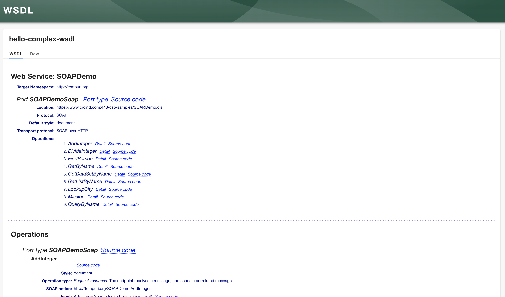
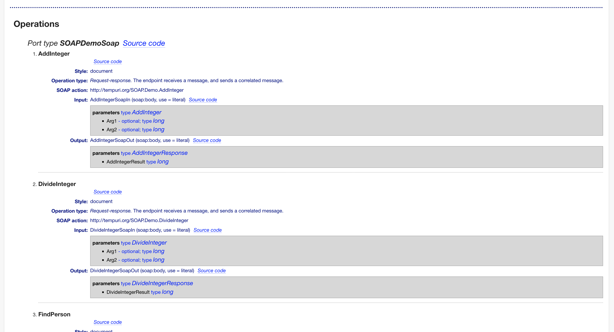
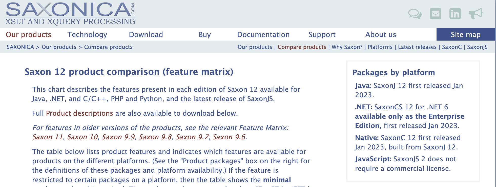

# API docs - WSDL plugin

## Setup

Follow [installation instructions](./plugins/api-docs-module-wsdl).

## Screenshots

## Local development

There is a local setup at `plugins/api-docs-module-wsdl/dev` which can be started with `yarn dev` in the root directory.

## Update backstage deps

To update the plugin with the latest backstage dependencies run `yarn backstage-cli versions:bump`,
`yarn changeset` and create a PR.

## License

This library is under the [MIT](LICENSE) license.

### Saxon-js

Be aware that [saxon-js](https://www.npmjs.com/package/saxon-js) has a specific copyright.
As stated on the [open source support page](https://www.saxonica.com/support/opensource.xml) there is limited support
by Saxon.

Additionally, the software used in this project is the [HE edition](https://www.saxonica.com/products/feature-matrix-12.xml)
and doesn't require a commercial license.

> JavaScript: SaxonJS 2 does not require a commercial license.
> 
